
<h1 align="center">养老保险管理系统</h1>

## 简介
养老保险管理系统：角色分为管理员、员工；功能包括员工信息登记、用户登录、项目管理、公告资讯、留言管理、养老政策查询、保险类型管理、缴费记录查看，提供简洁直观的管理后台界面以提高管理效率。    --计算机毕业设计源码；毕设源码；java毕业设计源码

## 联系方式

<h3 align="center">获取完整代码与数据库文件 + 微信：deepguan QQ: 86050149 QQ群: 783742310</h3>

<h3 align="center">可帮忙远程部署 包运行成功！提供远程部署、修改代码、设计文档指导、代码讲解等服务！</h3>

## 功能介绍（完整见运行截图）
管理员：基本功能包括登录、注册和退出，以及管理保险、项目、员工和用户信息的能力。可以访问网站首页，进行公告、留言和养老政策的管理，能通过保险条目列表、项目列表进行数据查询和编辑操作。同时管理员可以查看、添加或删除公告、政策和留言，并管理管理员账号和权限。

用户：基本功能包括登录、注册，并可修改个人中心的信息，如账户头像、用户名和手机号。用户可以浏览网站首页，查看公告资讯和养老政策；在系统中查询和查看养老保险项目的相关信息，并可通过留言板提问咨询。用户还可以在个人中心管理个人的保险信息和查看相关报表。

## 运行截图
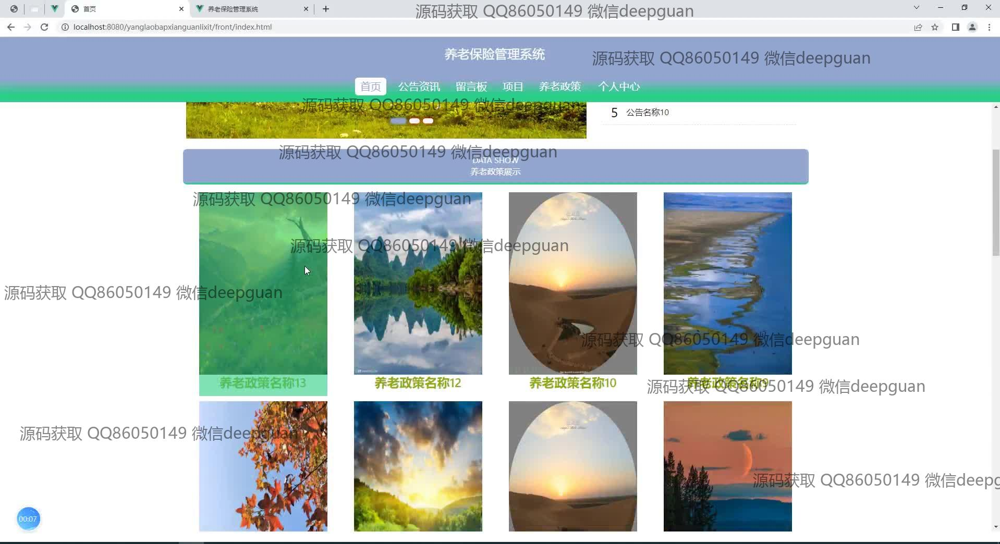
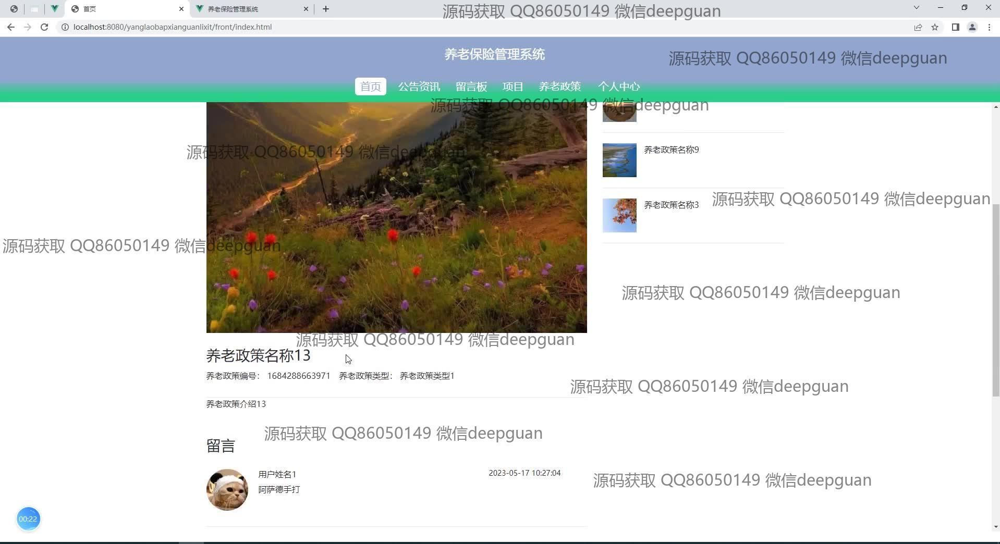
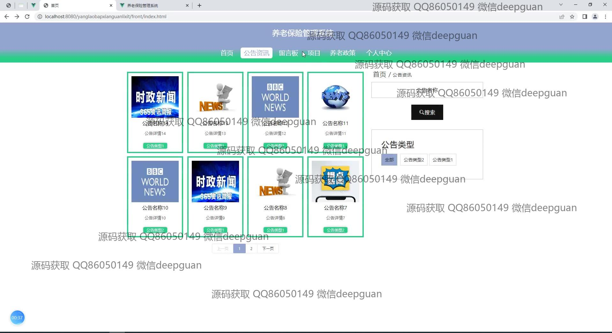
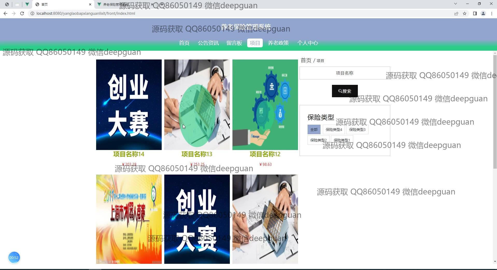
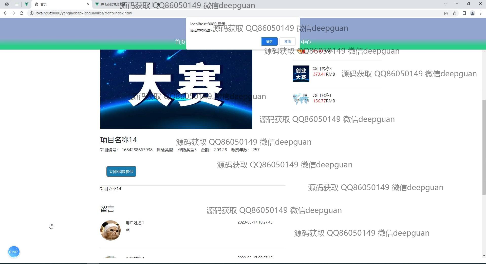
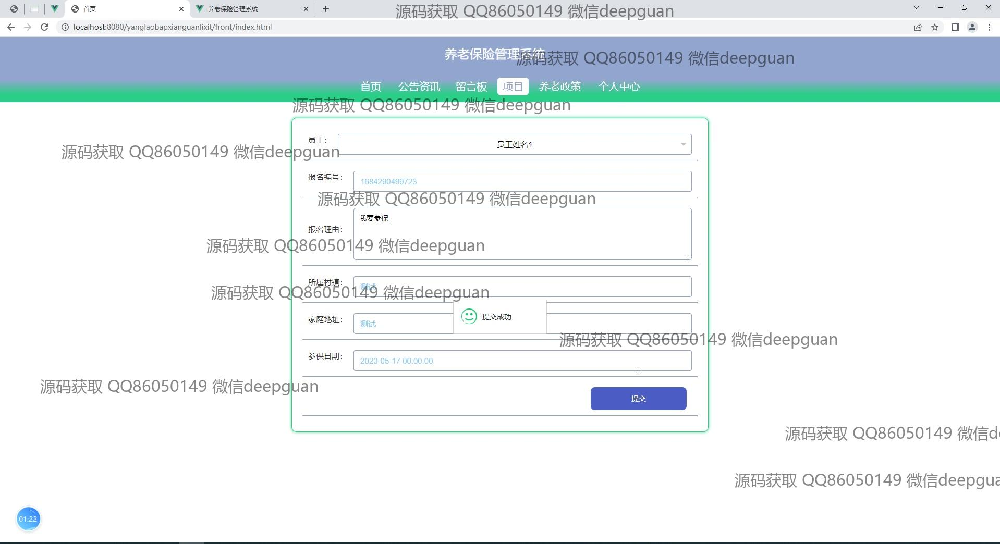
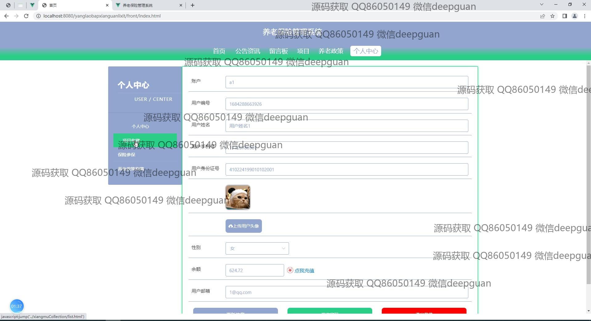
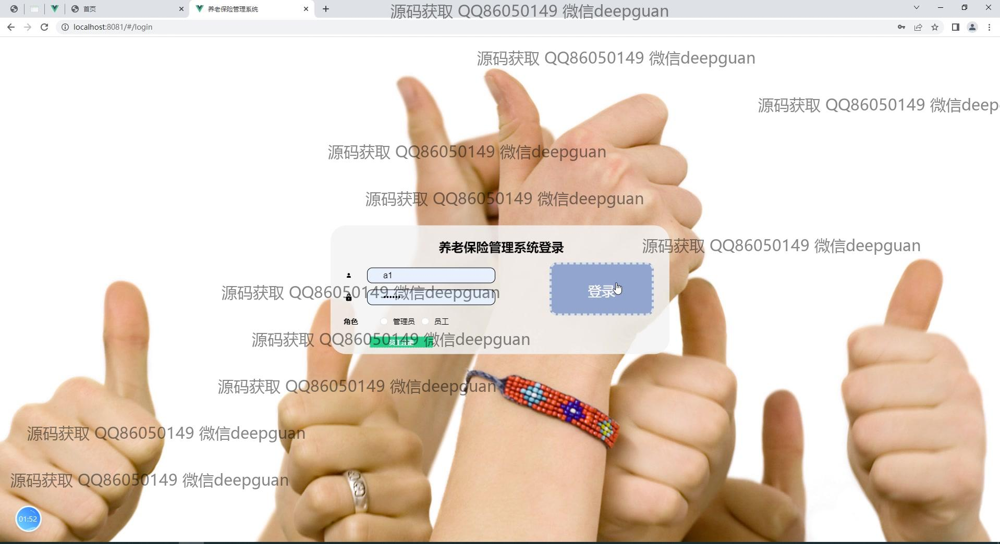
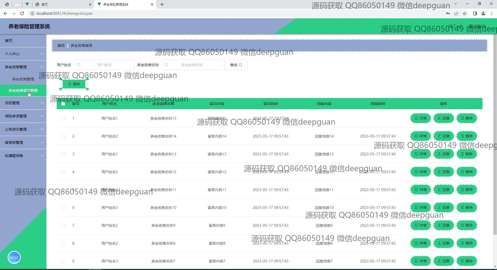
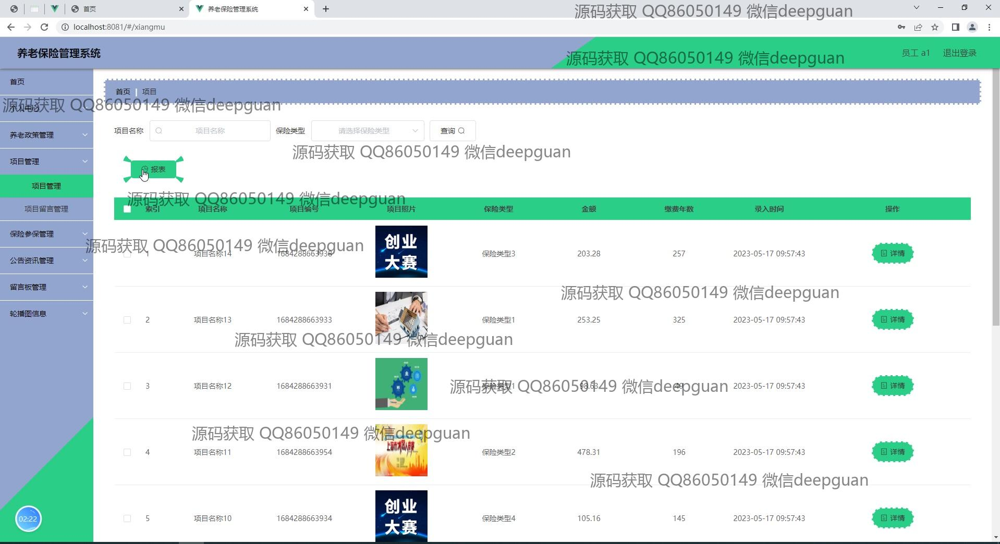

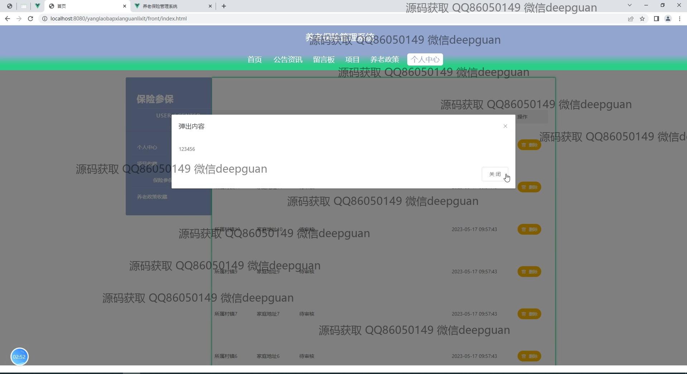
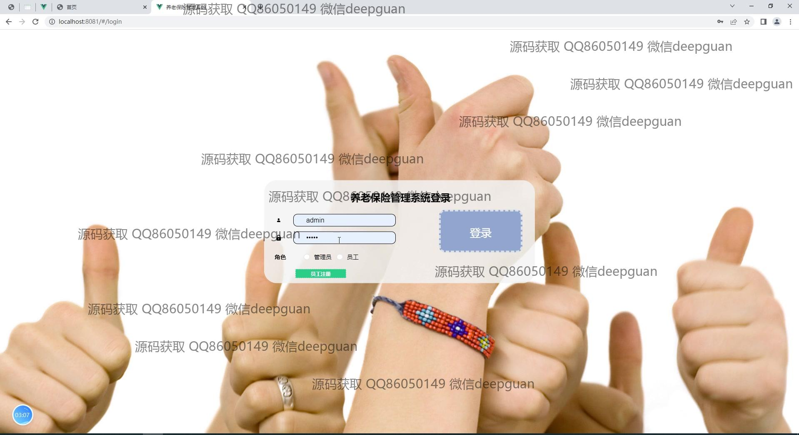
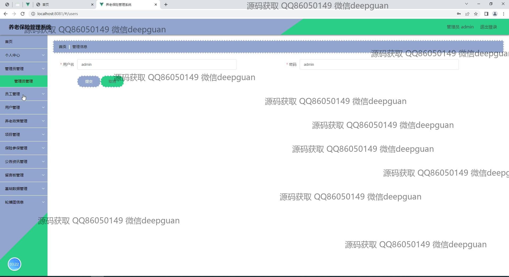
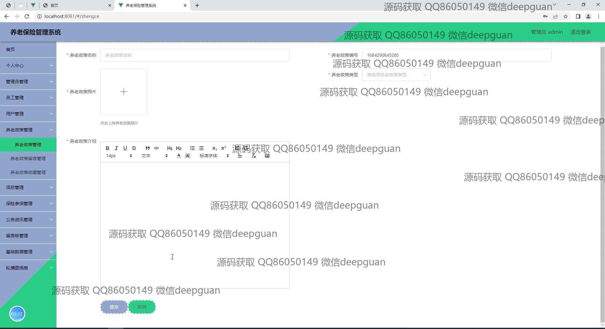
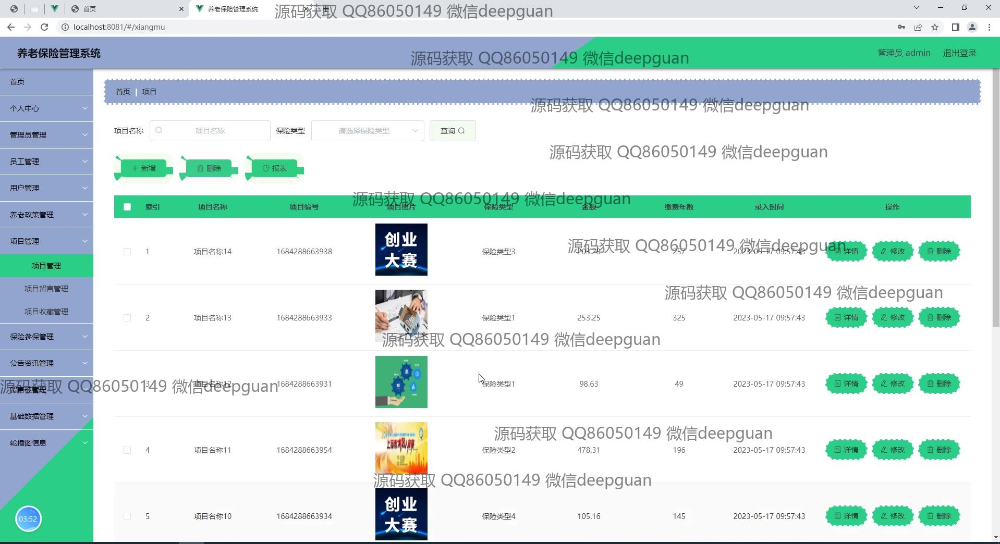
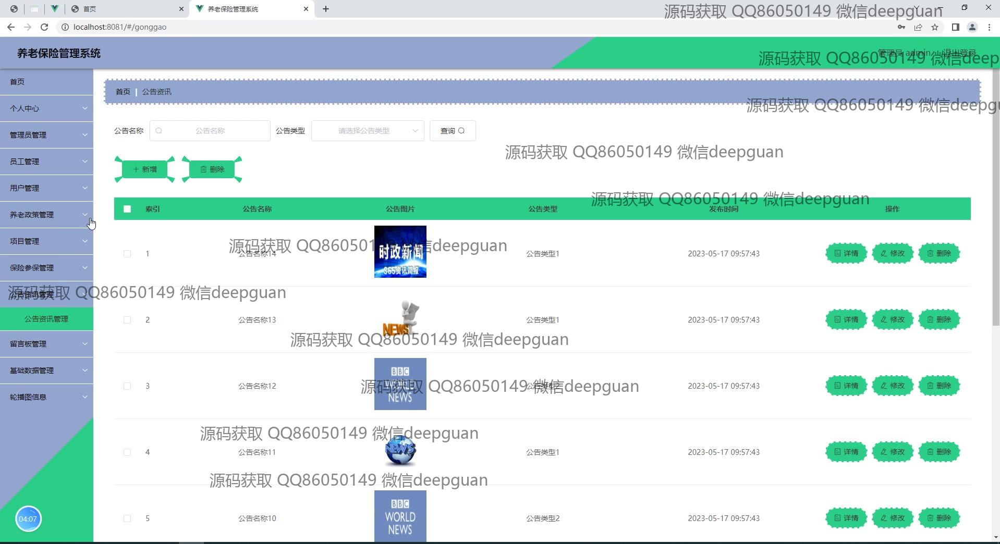
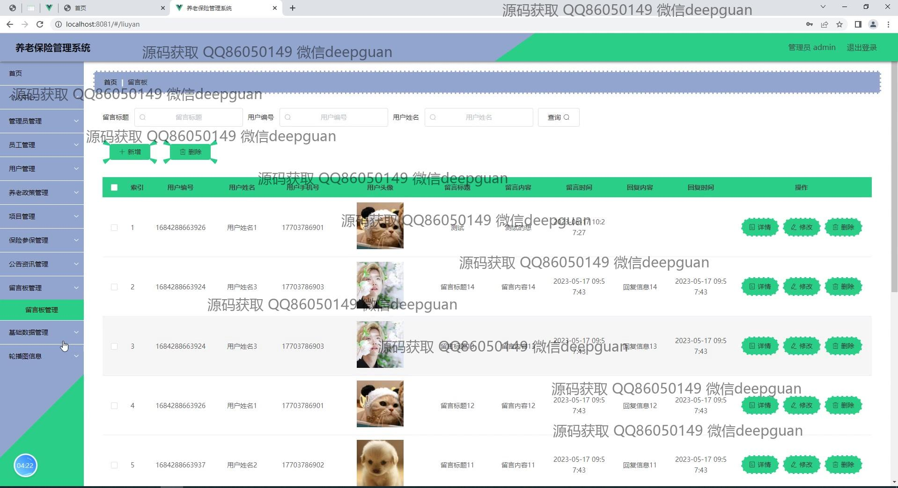
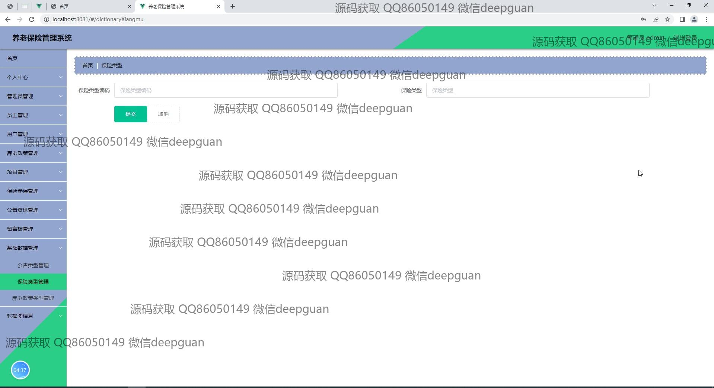

本代码来源于网络,仅供学习参考使用!

